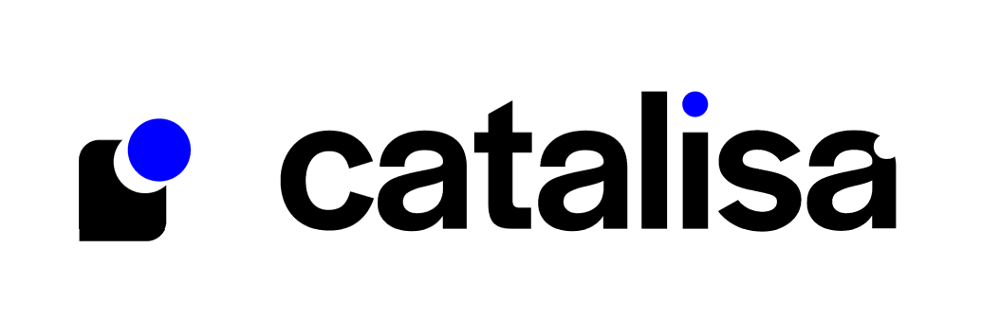

  
  
   
  
    
  

O **Catalisa** é uma plataforma de gestão de *Customer Experience* desenvolvida para capturar, processar e visualizar o feedback de usuários. A solução integra uma simulação de ambiente real (no caso do projeto, o site do cliente Sebrae) com um **chatbox** interativo de pesquisa e um painel administrativo onde há duas seções: o **Dashboard** e os **Insights**, para análise dos dados coletados nas pesquisas de usuário.

Há **dois links para acessar a aplicação** desenvolvida no projeto. O primeiro é o da plataforma do Catalisa, onde o gestor poderá ver os dados coletados nas pesquisas; e, o segundo é a réplica do site do nosso cliente (Sebrae), onde são realizadas às pesquisas de satifação na medida em que os usuários consomem produtos os serviços. 

*Obs: É importante salientar que ambos sites rodam no mesmo deploy. Sendo assim, apesar de não ser o ideal, por ser uma solução MVP, ambos utilizam o mesmo usuário.*

#### 🔗 Links Importantes
- Deploy
  - [Site no Ar - Catalisa](http://104.248.217.165/)
  - [Site no Ar - Sebrae](http://104.248.217.165/sebrae)
- Screencast
  - [Screencast - Aplicação](https://www.youtube.com/watch?v=piaWC0mmUvU)
  - [Screencast - Prototipação](https://youtu.be/4Ie5NhUl014)

---

## 💡 Solução
<se>
O projeto foi estruturado em duas grandes frentes para atender tanto o usuário final quanto o gestor da empresa:

### 1. Coleta e Simulação (Cliente)
Para garantir uma experiência realista, foi desenvolvida uma réplica do site do Sebrae.
* **Simulação de Navegação:** Cópia fidedigna das telas de login, cadastro e cursos (Marketing Digital e Gestão Financeira) para simular o consumo de produtos.
* **Web Scraping:** Utilização de scripts em Python para extrair e converter páginas dinâmicas originais em versões estáticas integradas ao sistema.
* **Chatbox Interativo:** Substituição de formulários tradicionais por um *chatbox* animado que aparece após o consumo de um serviço, capturando a satisfação e comentários do usuário de forma amigável.

### 2. Plataforma Catalisa (Gestor)
Um painel administrativo para visualização centralizada dos dados processados pelo Back-end.
* **Dashboard:** Exibição de cinco gráficos fundamentais para análise de dados coletados durante às pesquisas de usuário: 
    - Distribuição de Respostas;
    - Nível de Satisfação;
    - Taxa de Resposta;
    - Análise de Comentários;
    - CSAT;
* **Insights:** Seção dedicada à visualização detalhada de feedbacks individuais, contendo nota, data e comentários.
* **Análise de Sentimento:** Processamento automático dos comentários no Back-end, categorizando-os desde "Muito Positivo" até "Muito Negativo" por meio de um algoritmo.

---

## 🛠 Ferramentas e Tecnologias Utilizadas

O desenvolvimento seguiu uma arquitetura moderna, garantindo escalabilidade e performance.

  
  
  
  
   
  
  
  
  
  

Para mais detalhes, ver documentação completa:

- [Front-End](https://docs.google.com/document/d/1BCPwgaPSz4-CjFFqfrTwOSaboBaHtbkMcTwyoGJeddg/edit?usp=sharing)

- [Back-End](https://docs.google.com/document/d/1ZAj9sPM-V6TTuqKSapx4ZaFqVBlUtILXfcKax_1ekKY/edit?usp=sharing)

---

## 👥 Equipe
#### Desenvolvedores
* [Amanda Luz](https://github.com/amandaaluzc) - alc2@cesar.school
* [Eric Gonçalves](https://github.com/eric-albuquer) - ega2@cesar.school
* [Gabriel Aniceto](https://github.com/gabrielaniceto1) - gasab@cesar.school
* [João Vitor Passos](https://github.com/iampassos) - jvap@cesar.school
* [Lucas Menezes](https://github.com/Lucasmenezes08) - lms4@cesar.school
* [Mircio Ferreira](https://github.com/Mircio-Ferreira) - mfsn@cesar.school
* [Ricardo Sérgio Freitas](https://github.com/whosricardo) - rspff@cesar.school
* [Thiago Fernandes](https://github.com/ThIagoMedeiros21) - tfm3@cesar.school

#### Designers
* Maria Eduarda Leal - melo@cesar.school
* Mariana Padilha - mmp2@cesar.school
* Rafael Lima - rlr@cesar.school

#### Orientadora
* Natália Aquino

---